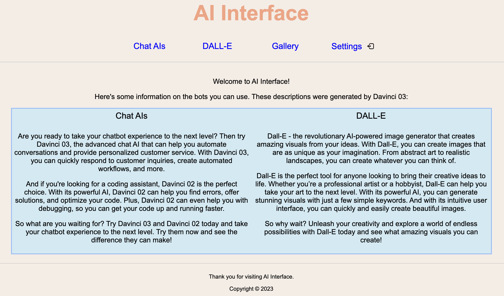
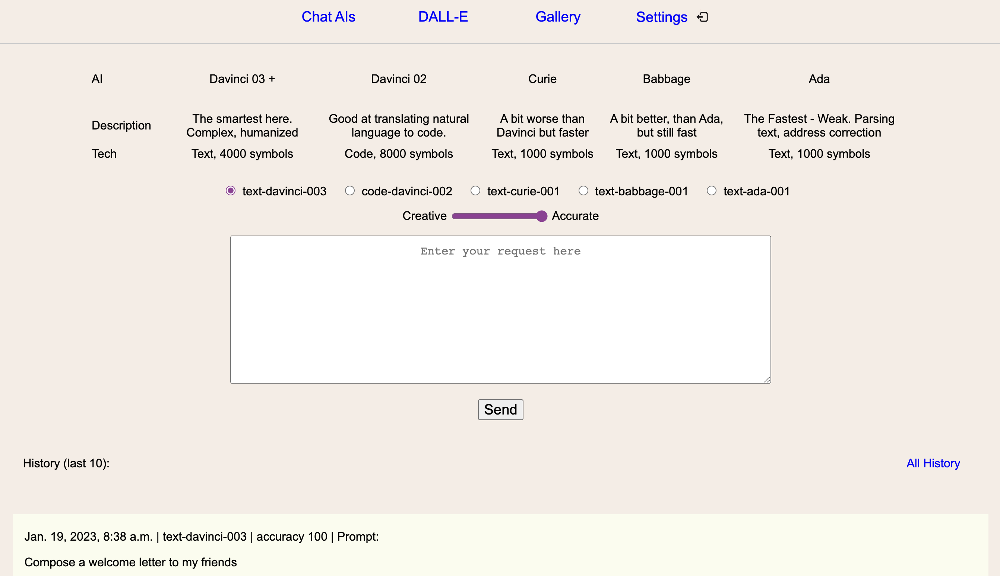
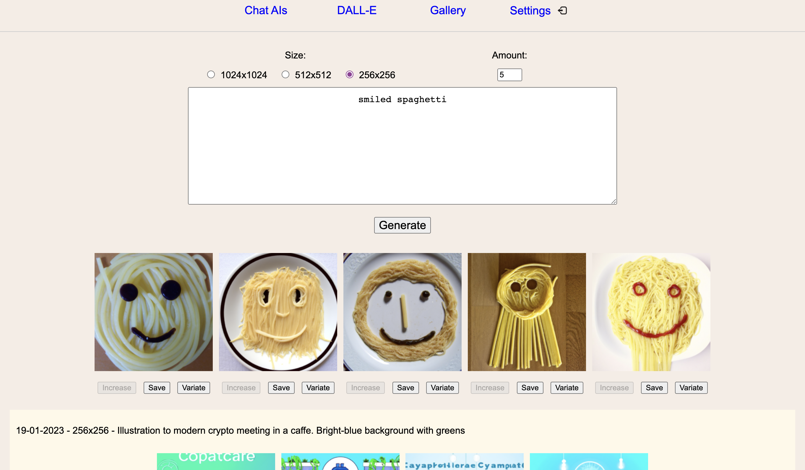

# OpenAI & Django
This is my first Django project, and I'm excited to learn how to make OpenAI and Django work together!

I'll build a simple web application that uses OpenAI to generate responses to user input. And I'll try to connect image generation as well. After that I'll add functionality to save the result to local database.

## Installation:
I suppose you're familiar with Python...

### Part 1 - grab the code
1. Clone repository
2. Create venv & install requirements

### Part 2 - set up keys
1. Copy .env.example, change name to .env
2. Add your OpenAI API key to OPENAI_SECRET_KEY, don't use spaces
3. Change DJANGO_SECRET_KEY to whatever you want, that's not too important while we run it locally

### Part 3 - run server
1. Activate virtual environment 
2. Go to project root directory
3. Write:
   - python3 manage.py makemigrations
   - python3 manage.py migrate
4. Start the server "python3 manage.py runserver"
5. Enjoy - http://127.0.0.1:8000/

## Current functionality:

### Main page

### Chat AIs

### Dall-E (image generating model)

